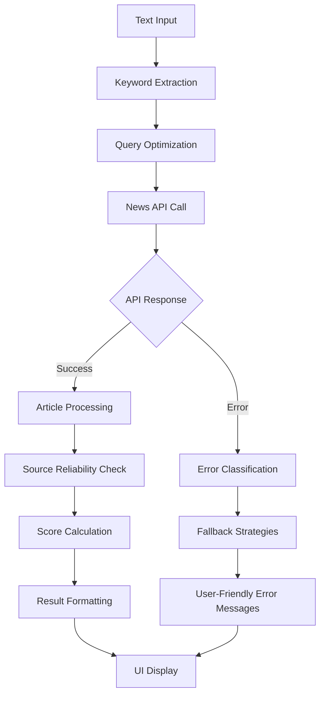

# Design Document

## Overview

The News Source Verification feature is currently failing due to several issues in the implementation. The feature shows an ERROR status and displays 0 values for all metrics. This design addresses the root causes and provides a robust solution for news verification functionality.

## Architecture

### Current Issues Identified

1. **API Configuration Problems**: The GNews API key may be invalid or the API endpoint may have changed
2. **Error Handling**: Generic error responses don't provide specific feedback to users
3. **Query Construction**: The current keyword extraction method may be too simplistic
4. **Source Reliability Logic**: The reliable source matching logic may not be working correctly
5. **Frontend Display**: The UI shows ERROR status without specific error details

### Proposed Solution Architecture



## Components and Interfaces

### 1. Enhanced Keyword Extraction Component

**Purpose**: Extract meaningful keywords from text for news API queries

**Interface**:
```python
def extract_news_keywords(text: str) -> Dict[str, Any]:
    """
    Extract relevant keywords for news search
    Returns: {
        'primary_keywords': List[str],
        'secondary_keywords': List[str], 
        'entities': List[str],
        'query_string': str,
        'confidence': float
    }
    """
```

**Implementation Strategy**:
- Use NLP techniques to identify named entities (people, places, organizations)
- Extract key phrases using TF-IDF or similar algorithms
- Filter out common stop words and irrelevant terms
- Prioritize proper nouns and specific terms
- Generate multiple query variations for better results

### 2. Robust API Client Component

**Purpose**: Handle news API calls with proper error handling and retry logic

**Interface**:
```python
async def query_news_api(keywords: Dict[str, Any]) -> Dict[str, Any]:
    """
    Query news APIs with enhanced error handling
    Returns: {
        'status': str,
        'articles': List[Dict],
        'total_found': int,
        'api_used': str,
        'error_details': Optional[str]
    }
    """
```

**Implementation Strategy**:
- Implement exponential backoff for rate limiting
- Support multiple news API providers as fallbacks
- Validate API responses before processing
- Provide detailed error classification
- Cache successful responses to reduce API calls

### 3. Enhanced Source Reliability Analyzer

**Purpose**: Analyze news sources for credibility and reliability

**Interface**:
```python
def analyze_source_reliability(articles: List[Dict]) -> Dict[str, Any]:
    """
    Analyze reliability of news sources
    Returns: {
        'reliable_count': int,
        'total_count': int,
        'reliability_score': float,
        'source_breakdown': List[Dict],
        'reliability_factors': Dict[str, Any]
    }
    """
```

**Implementation Strategy**:
- Expand reliable sources database with more comprehensive list
- Implement domain-based and source-name matching
- Add bias and credibility scoring
- Consider source authority and fact-checking history
- Provide detailed breakdown of reliability assessment

### 4. Improved Error Handling System

**Purpose**: Provide specific, actionable error messages to users

**Error Categories**:
- API Configuration Errors (invalid keys, missing keys)
- Network Errors (timeouts, connection issues)
- Rate Limiting Errors (quota exceeded)
- Content Errors (no relevant keywords found)
- Service Unavailability Errors (API down)

## Data Models

### NewsVerificationResult
```python
@dataclass
class NewsVerificationResult:
    status: str  # 'success', 'partial', 'error', 'no_results'
    total_articles: int
    reliable_sources: int
    reliability_ratio: float
    reliability_score: float  # 0-100 percentage
    top_articles: List[Article]
    source_breakdown: List[SourceAnalysis]
    error_details: Optional[str]
    api_used: str
    query_used: str
    processing_time: float
```

### Article
```python
@dataclass
class Article:
    title: str
    url: str
    source_name: str
    source_url: str
    published_date: str
    description: str
    is_reliable: bool
    reliability_factors: List[str]
```

### SourceAnalysis
```python
@dataclass
class SourceAnalysis:
    source_name: str
    source_domain: str
    is_reliable: bool
    reliability_score: float
    credibility_factors: List[str]
    bias_rating: Optional[str]
```

## Error Handling

### Error Classification System

1. **Configuration Errors**
   - Missing API keys
   - Invalid API keys
   - Malformed configuration

2. **Network Errors**
   - Connection timeouts
   - DNS resolution failures
   - SSL certificate issues

3. **API Errors**
   - Rate limiting (429)
   - Authentication failures (401, 403)
   - Service unavailable (503)
   - Invalid requests (400)

4. **Content Errors**
   - No keywords extracted
   - Query too generic
   - No relevant results found

### Error Response Strategy

Each error type will have:
- Specific error message for users
- Technical details for debugging
- Suggested actions for resolution
- Fallback options when available

### Retry Logic

- Exponential backoff for rate limiting
- Maximum 3 retry attempts
- Different retry strategies for different error types
- Circuit breaker pattern for persistent failures

## Testing Strategy

### Unit Tests

1. **Keyword Extraction Tests**
   - Test with various text types (news, social media, formal documents)
   - Verify entity recognition accuracy
   - Test edge cases (very short text, non-English text)

2. **API Client Tests**
   - Mock API responses for different scenarios
   - Test error handling for various HTTP status codes
   - Verify retry logic and backoff behavior

3. **Source Reliability Tests**
   - Test reliable source detection accuracy
   - Verify scoring algorithm consistency
   - Test with various source formats and domains

### Integration Tests

1. **End-to-End Verification Flow**
   - Test complete verification process with real API calls
   - Verify UI display of results
   - Test error scenarios with actual API failures

2. **Performance Tests**
   - Measure response times for various text lengths
   - Test concurrent request handling
   - Verify memory usage and resource cleanup

### Error Scenario Tests

1. **API Failure Simulation**
   - Test behavior when APIs are unavailable
   - Verify graceful degradation
   - Test user experience during failures

2. **Configuration Tests**
   - Test with missing/invalid API keys
   - Verify error messages are user-friendly
   - Test fallback mechanisms

## Implementation Phases

### Phase 1: Core Fixes
- Fix immediate API configuration issues
- Improve error handling and user feedback
- Enhance keyword extraction logic

### Phase 2: Reliability Improvements
- Expand reliable sources database
- Implement advanced source analysis
- Add retry logic and fallback mechanisms

### Phase 3: Enhanced Features
- Add multiple news API support
- Implement caching for better performance
- Add detailed source credibility analysis

### Phase 4: UI/UX Improvements
- Enhanced error message display
- Progress indicators for long operations
- Detailed verification result breakdown